# Monaco GP — Circuit Walk 🏎️

A fully explorable 3D recreation of the Monaco Grand Prix street circuit, built as **a single self-contained `index.html`** — no build step, no external assets, everything procedural. Three.js from CDN is the only dependency.

Walk the circuit on foot at golden hour while eight F1 cars race the streets around you: Port Hercule and its harbor, the Tunnel, Casino Square, La Piscine, the Grandstand, and the pit lane.

Built iteratively with Claude Code over ~57 self-directed improvement passes — every pass screenshot-verified, logged in [IMPROVEMENTS.md](IMPROVEMENTS.md), and kept only if it was an obvious upgrade.

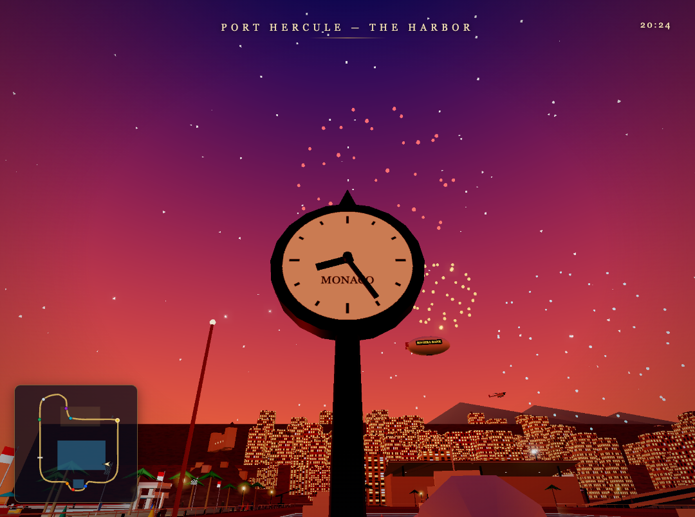

## Running it

```bash
python3 -m http.server 8741
# open http://localhost:8741/index.html
```

Or just open `index.html` in a browser (a local server avoids stricter file:// module rules).

## Controls

| Key | Action |
|---|---|
| WASD / mouse | walk & look |
| SHIFT | run |
| SPACE | jump |
| TAB | full track map — **click anywhere to fast travel** |
| M | minimap toggle |
| E | ride the Ferris wheel · sit on benches, grandstand & café chairs |
| G | guided tour of the circuit (10 stops) |
| T (hold) | fast-forward the sun |
| P | photo mode (hide UI) |
| R | reset to the start line |

## The race is a real simulation

Eight sponsored F1 cars (RIVIERA BANK, AZUR JETS, CHRONO D'OR, MONARQUE, ORO D'AZUR, LUMIÈRE, CAFÉ DE PARIS, MISTRAL) lap the circuit continuously:

- **Corner accordion** — per-corner speed factors mean cars brake into Ste Dévote, the hairpin and the chicanes, and stretch out on the straights
- **Brake lights & exhaust flares** react to what each car is actually doing
- **Real overtakes** — a small pace delta between lanes produces genuine side-by-side passes and position swaps
- **Lap counting drives everything**: the jumbotron P1, the gold leader ring on the map, and a live P1–P8 **scoring pylon** at the start/finish straight, all computed from true race progress
- A safety car, working pit stops with a full-size pit crew, drivers in every cockpit

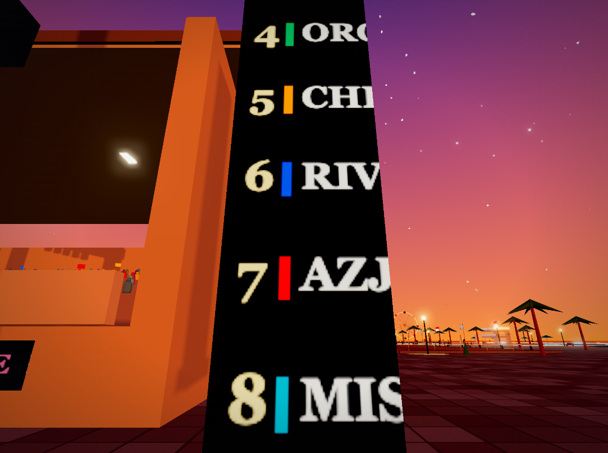

## A living world

Everything moves. Walkers with smooth strides (one with a dog on a leash), sitters on benches and café chairs, conversation clusters, window shoppers, a waiter shuttling tables, marshals with flags, TV crane and panning broadcast cameras, paparazzi at the victory podium, a Mexican wave through the grandstand, and **camera flashes across the crowd once the race lights come on**.

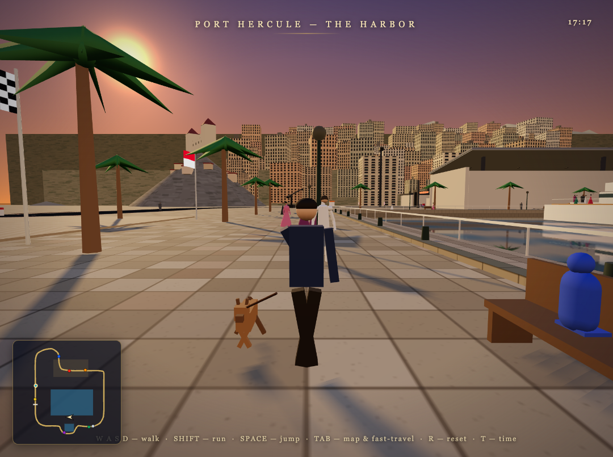

The harbor is fully alive: the AURELIA super-yacht with a deck party, a cruising tender with a foam wake, sailboats bobbing at anchor, a **fireboat spraying twin water arcs**, a jet ski carving circles, swimmers doing laps in the pool, gulls circling (and perched on real bollards), quay foam, and a fisherman on the quay whose float dips when he gets a bite.

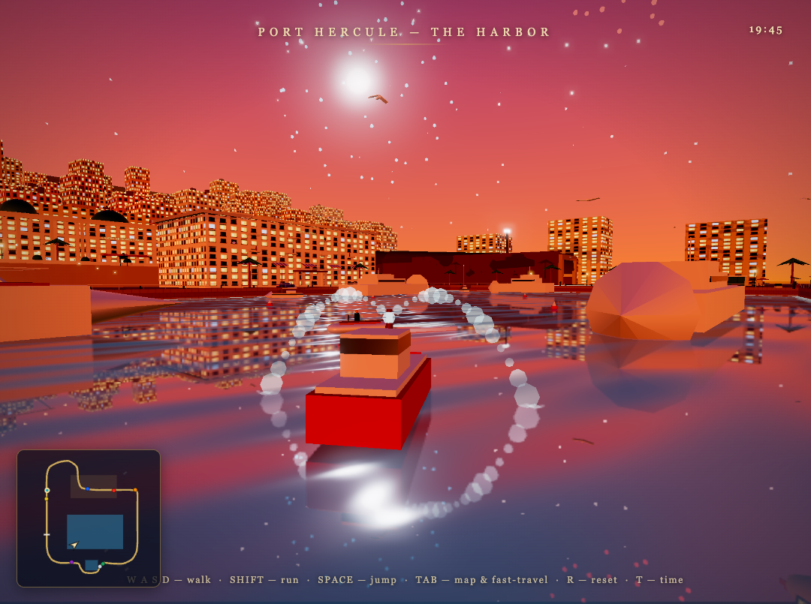

Interactive touches:

- **Pigeons around the Casino Square fountain scatter when you walk up to them**, then land and go back to pecking
- Fast travel by clicking anywhere on the TAB map (with labelled points of interest)
- Sit anywhere marked, ride the Ferris wheel, take the guided tour
- A working **street clock** on the promenade whose hands follow the in-game sun

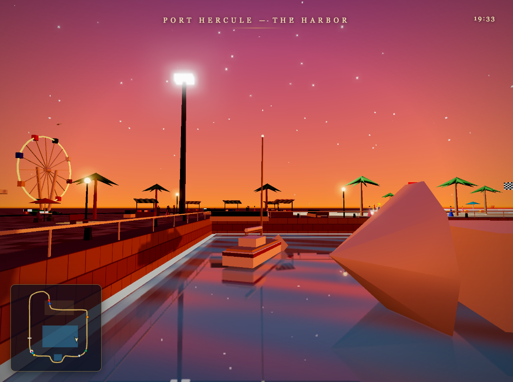

## Atmosphere

A ping-ponging golden-hour cycle (16:15 ↔ 20:33): warm dusk light, a procedural sky and water shaders, night materials that come up with the race lights — lit skyline windows, the glowing Ferris wheel rim, pool glow, string lights on the yacht, fireworks over the harbor, and a sponsor blimp and TV helicopter overhead. The Prince's Palace watches from its mesa, with old-town houses stepping down the rock and the Tête de Chien ridge hazed behind the city.

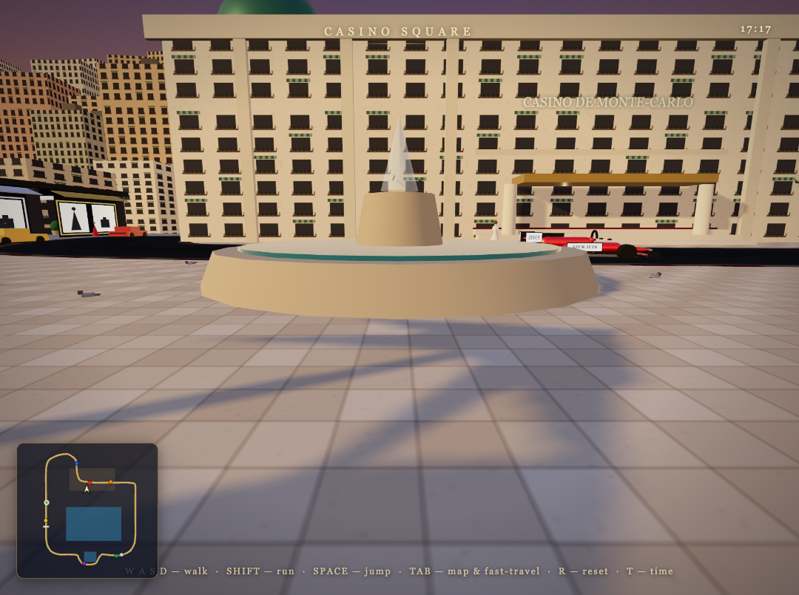
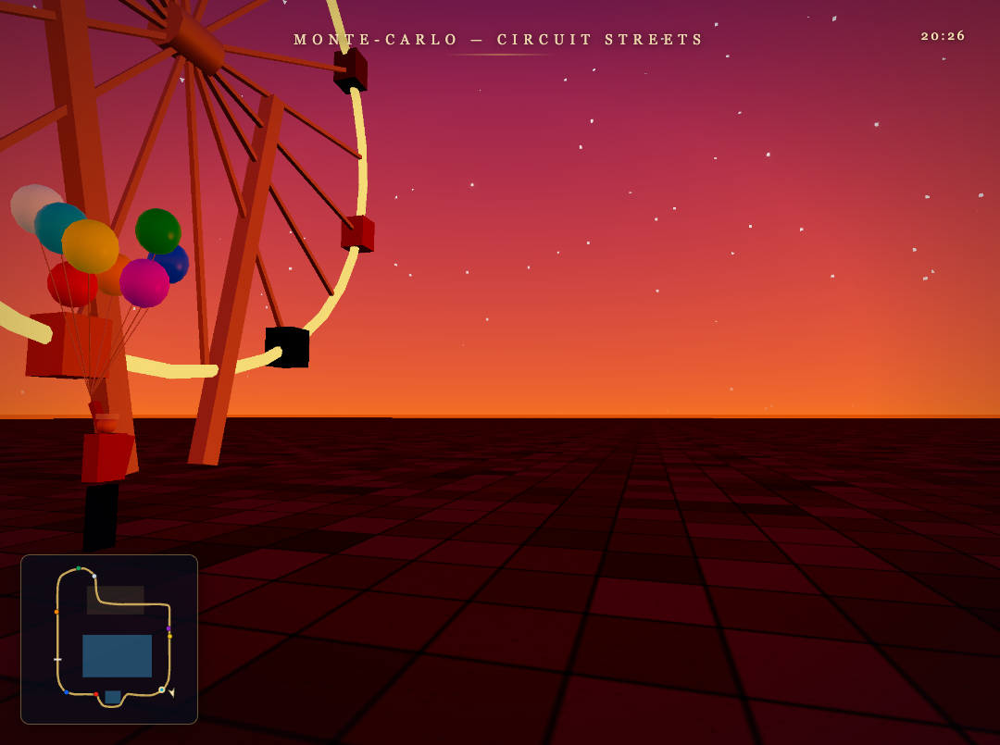

## More screenshots

The [screenshots/](screenshots/) folder holds 100+ captures — one or more from every improvement pass, in chronological order (`p1…` → `r52…`). [IMPROVEMENTS.md](IMPROVEMENTS.md) is the full pass-by-pass build log, including the bugs each screenshot review caught.

| | | |
|---|---|---|
| 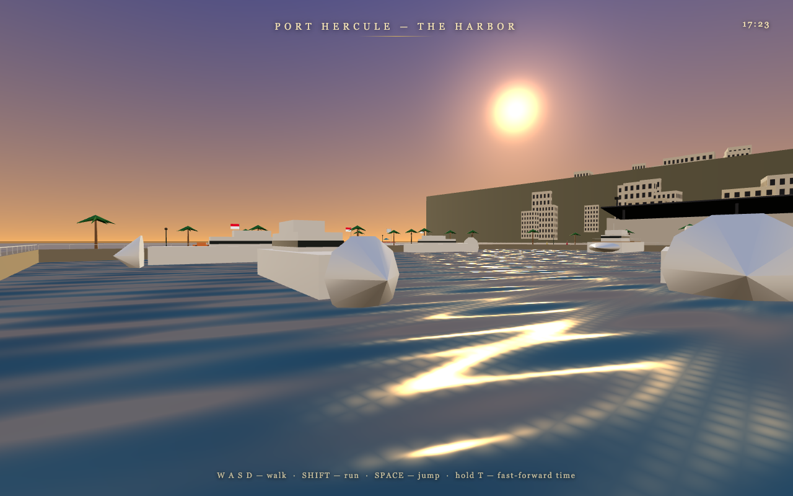 | 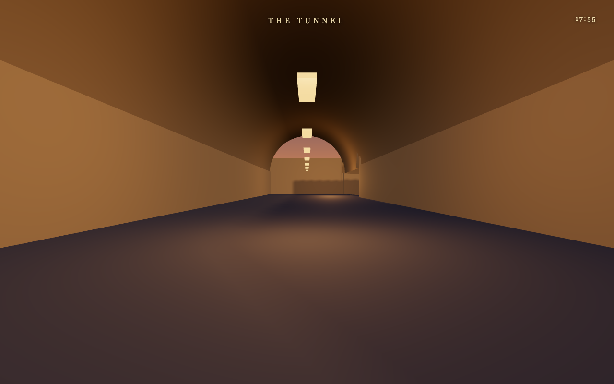 | 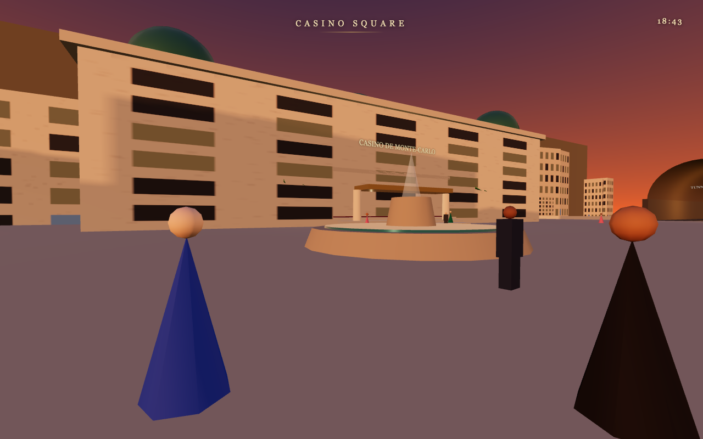 |
| 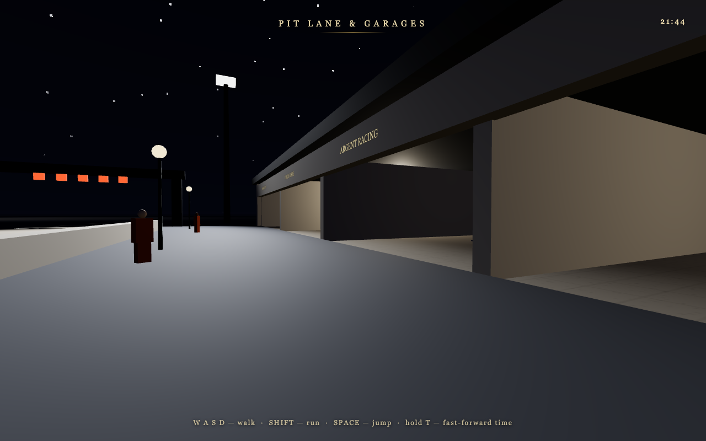 | 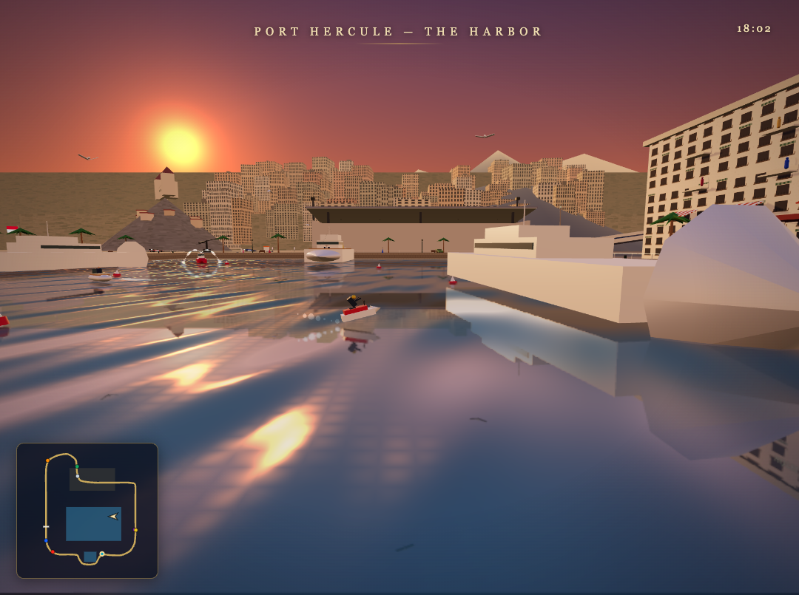 | 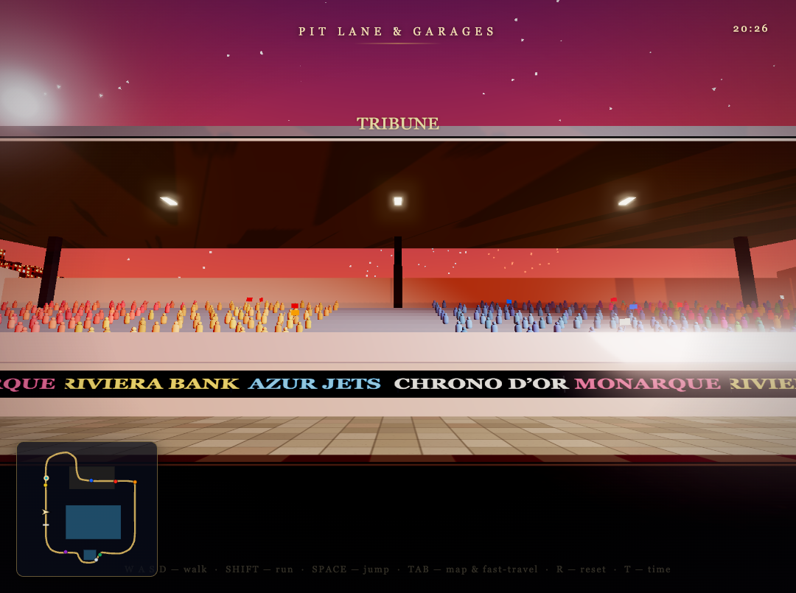 |

## Tech notes

- **One file.** All geometry, textures (canvas-generated), shaders, audio (WebAudio-synthesized), UI and game logic live in `index.html` (~3,000 lines)
- Three.js r160 via importmap; custom sky & water `ShaderMaterial`s; instanced crowds and NPCs with LOD; canvas textures for every sign, screen and leaderboard
- Runs at 120 fps on an M-series MacBook
- Debug API on `window.__mc` (teleport, set hour, race telemetry, clip scanning) — used for the automated screenshot verification during the build loop

🤖 Built with [Claude Code](https://claude.com/claude-code)
